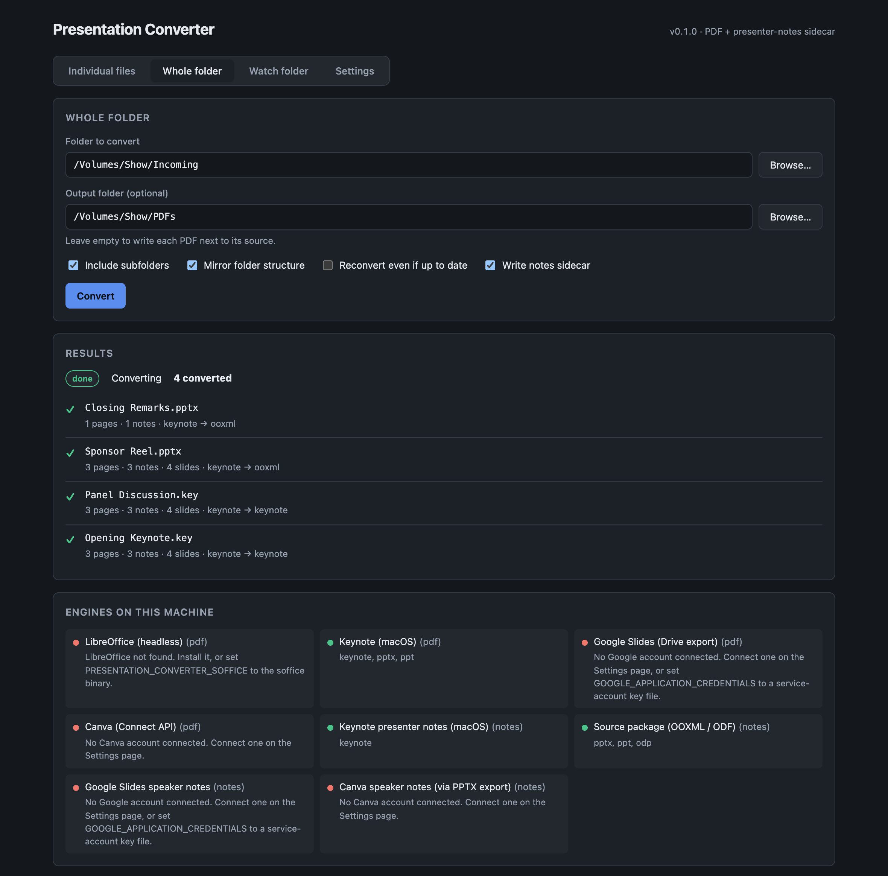
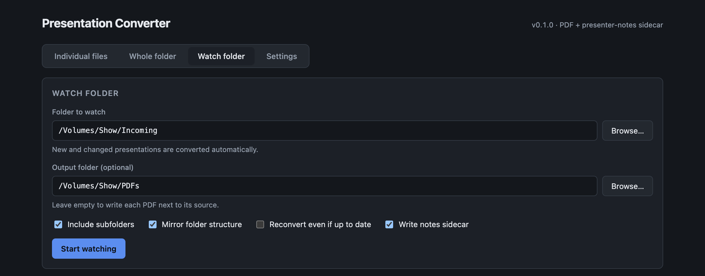
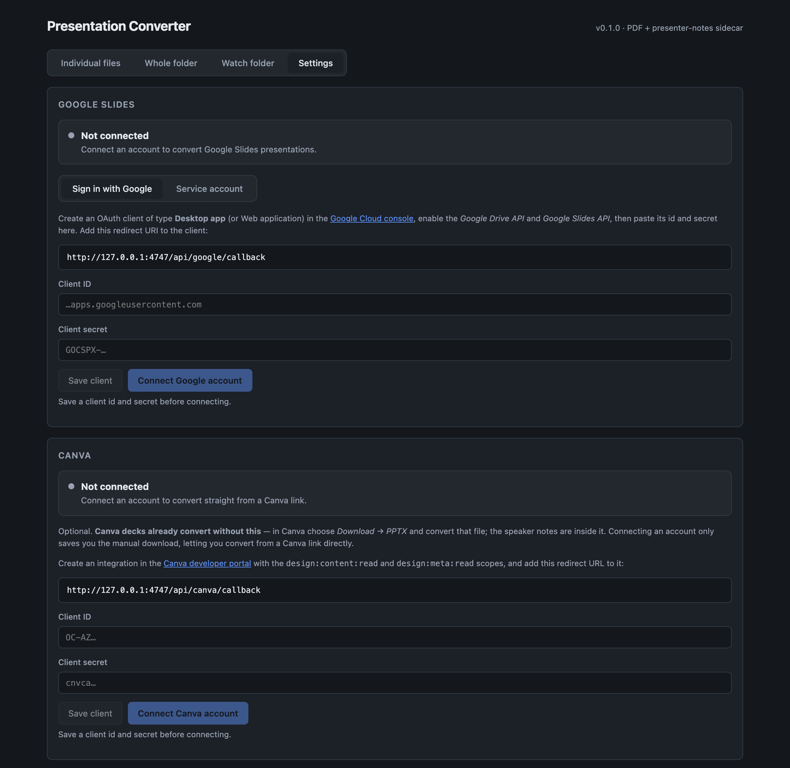

# Presentation Converter

> **AI-assisted project.** This codebase was created with [Claude Code](https://claude.com/claude-code)
> (Anthropic), directed and reviewed by a human author — including the code, the docs,
> and the design decisions recorded below. Review it yourself before relying on it in
> production, same as you would for any code.

Converts Keynote, PowerPoint, Google Slides, Canva and OpenDocument presentations to PDF —
**and keeps the presenter notes**, in a `.notes.json` sidecar written next to each PDF.

Exporting a deck to PDF is easy. Every tool that does it throws the speaker notes away,
which is a problem if the PDF is what you actually present from. This tool exports the
PDF *and* recovers the notes, mapped to the right page.

- A **desktop GUI** — pick files, convert a whole folder, or leave a watch folder running,
  and connect Google or Canva accounts from the Settings tab.
- A **CLI and library** — the backend other programs drive, including
  [presentation-commander](https://github.com/stoatworks-labs/presentation-commander-client),
  which reads the sidecars this produces.
- A **Nextcloud app** — keeps PDF versions of every presentation in a folder and its
  subfolders up to date automatically.



*Real captures of the running app, not mockups — produced by `npm run screenshots`,
which converts a demo folder and photographs the result.*

## The problem it actually solves

A deck's slide count and its PDF's page count usually **disagree**, because every exporter
silently drops hidden or skipped slides. Convert a 4-slide deck whose third slide is
hidden and you get a 3-page PDF — so a naive tool puts slide 3's notes on page 3, and
every note from there on is one page out.

This tool reads the PDF back, reconciles the two, and records what it did:

```jsonc
"alignment": "adjusted"   // hidden slides accounted for; mapping is trustworthy
"alignment": "exact"      // counts agreed
"alignment": "mismatch"   // couldn't reconcile — notes emitted, but flagged as suspect
```

A `mismatch` is surfaced in the CLI, the GUI and the sidecar's `warnings` rather than
being quietly wrong.

## Install

Requires Node.js 20+.

```bash
git clone https://github.com/stoatworks-labs/presentation-converter.git
cd presentation-converter
npm install
npm run build
```

For PowerPoint and ODP files, install [LibreOffice](https://www.libreoffice.org/); on
macOS, Keynote can stand in for it. Check what your machine can do:

```bash
node packages/cli/dist/index.js doctor
```

## Use it

Convert some files, or a whole tree:

```bash
presentation-converter convert "Q3 Review.key" "Keynote Address.pptx"
```

```bash
presentation-converter batch ~/Decks --out-dir ~/PDFs
```

Watch a folder and convert whatever lands in it:

```bash
presentation-converter watch ~/Dropbox/Incoming --out-dir ~/PDFs
```



Run the GUI (and the worker API) at <http://127.0.0.1:4747>:

```bash
presentation-converter serve
```

Everything takes `--json` for scripting, and exits non-zero if any file failed.

### Options worth knowing

| Flag | Effect |
| --- | --- |
| `--out-dir <dir>` | write PDFs here instead of beside the source; the folder tree is mirrored |
| `--flat` | don't mirror subfolders — everything lands in one directory |
| `--force` | reconvert even when the output is already newer than the source |
| `--no-sidecar` | write only the PDF |
| `--pdf-engine <id>` | force `keynote`, `libreoffice`, `google-slides` or `canva` |
| `--exclude <text...>` | skip any path containing this text |
| `--dry-run` | (batch) list what would be converted, then stop |

Re-runs are incremental: a deck whose PDF and sidecar are already newer than it is
skipped, so a repeat batch over an unchanged folder takes milliseconds.

## What it converts, and with what

Notes extraction is deliberately **independent of PDF rendering**. For Office and ODF
files the notes are read straight out of the source package's XML, so they're the
author's exact text regardless of which engine drew the PDF — and it works headless, with
no application installed.

| Format | PDF rendered by | Notes read from |
| --- | --- | --- |
| `.key` | Keynote (macOS only) | Keynote |
| `.pptx` | LibreOffice, or Keynote on macOS | the `.pptx` package (OOXML) |
| `.ppt` | LibreOffice | promoted to `.pptx`, then the package |
| `.odp` | LibreOffice | the `.odp` package (ODF) |
| Google Slides | Drive export | Slides API |
| Canva | PPTX export, rendered locally | the exported `.pptx` (OOXML) |

Keynote cannot run on Linux, so a Linux host needs a paired Mac for `.key` files — see
[the Nextcloud notes](docs/nextcloud.md).

### Google Slides

Pass a share URL, a file id, or a `.gslides` shortcut:

```bash
presentation-converter convert "https://docs.google.com/presentation/d/FILE_ID/edit" -o ~/PDFs
```

Connect an account first, either way round:

**In the GUI** — run `presentation-converter serve`, open the **Settings** tab, and either
sign in with Google or paste a service-account key. Credentials are stored in your user
config directory with `0600` permissions; the page shows the exact path.

**By environment variable** — best for servers, and takes precedence over anything saved
in the GUI:

```bash
export GOOGLE_APPLICATION_CREDENTIALS=/path/to/service-account.json
```

Either route needs the **Google Drive API** and **Google Slides API** enabled on the
project. A service account can only see presentations that have been shared with its email
address, and Drive refuses to export presentations over 10 MB.

### Canva

Convert straight from a Canva link, once an account is connected in **Settings → Canva**:

```bash
presentation-converter convert "https://www.canva.com/design/DAFxyz123/edit" -o ~/PDFs
```

Or with no setup at all: export from Canva with *Download → PPTX* and convert that file
like any other PowerPoint deck — Canva embeds the speaker notes in it.

The engine exports **PPTX, never PDF**, and renders that file locally. Canva's API exposes
no notes field, so a PPTX has to be fetched anyway; taking the pages from the same artefact
halves the API cost and guarantees the notes and the pages describe the same version of the
deck. That does mean LibreOffice or Keynote is required. See [docs/canva.md](docs/canva.md).

### Connecting accounts



Credentials are stored in your user config directory with `0600` permissions, and the page
shows the exact path. Environment variables, when set, take precedence over anything saved
here.

## The sidecar

`Q3 Review.pdf` gets `Q3 Review.notes.json` beside it:

```json
{
  "schemaVersion": 1,
  "generator": "presentation-converter 0.1.0",
  "convertedAt": "2026-07-28T16:20:24.230Z",
  "source": { "file": "Q3 Review.key", "format": "keynote" },
  "pdf": { "file": "Q3 Review.pdf", "pageCount": 3 },
  "slideCount": 4,
  "engines": { "pdf": "keynote", "notes": "keynote" },
  "alignment": "adjusted",
  "notes": {
    "1": "Thank the sponsors.\nMention the fire exits.",
    "3": "Hand over to Alex."
  },
  "slides": [
    { "index": 3, "page": null, "title": "Hidden Backup", "notes": "…", "hidden": true }
  ],
  "warnings": []
}
```

`notes` is the map consumers read — **PDF page number to note text**. `slides` keeps the
full picture, including hidden slides that have no page. Full details and the
compatibility rules are in [docs/sidecar-format.md](docs/sidecar-format.md).

## Using it from another program

```ts
import { convertFile, convertFolder, WatchFolder } from '@presentation-converter/core'

const result = await convertFile({
  sourcePath: '/decks/Q3 Review.key',
  outputDir: '/out'
})
console.log(result.pageCount, result.alignment)
```

Or drive the CLI and parse `--json`, which is what the Nextcloud app does.

## Nextcloud app

`nextcloud/presentationconverter` keeps PDFs of everything in the folders your users
nominate. Install and configuration are in [docs/nextcloud.md](docs/nextcloud.md).

## Repository layout

```
packages/core     conversion engines, notes extraction, sidecar, batch, watch, settings
packages/cli      the presentation-converter binary
packages/server   HTTP API, progress stream, GUI host, macOS worker endpoint
packages/web      the browser GUI
nextcloud/        the Nextcloud app (AGPL, as Nextcloud apps are)
```

## Development

```bash
npm run build       # everything
npm test            # core unit tests
npm run typecheck   # all workspaces
npm run dev         # server + GUI
npm run screenshots # regenerate docs/screenshots from the running app
```

`npm run screenshots` needs the server running (`npm run dev`) and Chrome installed. It
drives headless Chrome over the DevTools Protocol — no Puppeteer dependency — and measures
each panel so the images clip cleanly instead of relying on hard-coded heights.

## Status

Verified end to end on macOS against real Keynote-authored fixtures: `.key` and `.pptx`
conversion, hidden-slide page mapping, folder batches with tree mirroring, incremental
re-runs, output-collision detection, the watch folder, the GUI, and the worker endpoint.
The settings and OAuth endpoints are verified too — credential storage and `0600`
permissions, redaction (no secret is ever returned to the browser), forged-`state`
rejection, and the generated consent URL.

Canva is verified as far as it can be without an account: notes extraction from a real
Canva PPTX export, PKCE generation, the authorisation URL, and design-id parsing.

Not yet exercised against a live service: the Nextcloud app (written but never run — see
[docs/nextcloud.md](docs/nextcloud.md)), the LibreOffice engine (no LibreOffice on the
development machine), and full OAuth round trips for Google or Canva — each needs real
credentials and a human at the consent screen.

## Licence

MIT — see [LICENSE](LICENSE). The Nextcloud app under `nextcloud/` is AGPL-3.0, as
Nextcloud apps must be; see [nextcloud/LICENSE](nextcloud/LICENSE).
